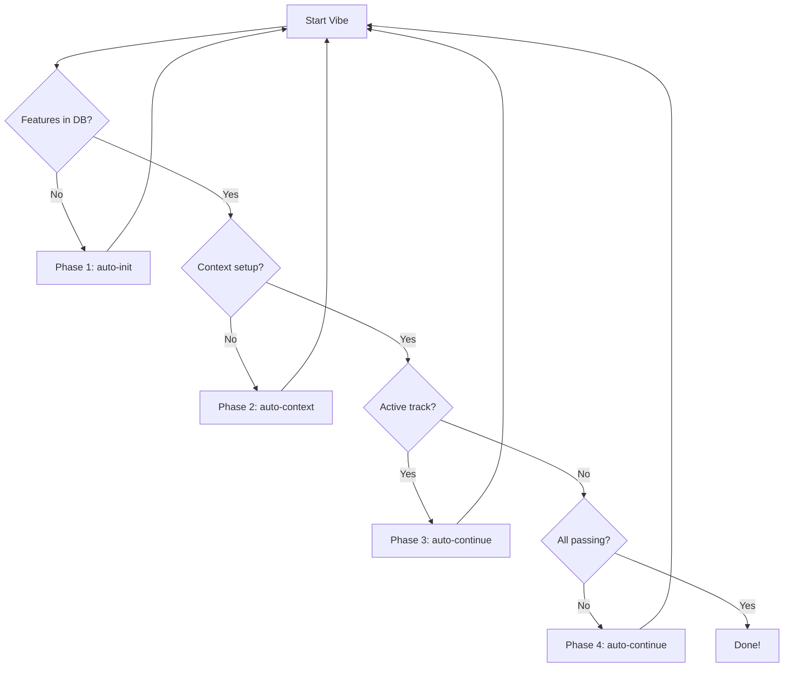

# Architecture: OpenCode Autocode

This document outlines the high-level architecture of the `opencode-autocode` CLI tool.

## Overview

`opencode-autocode` bridges the gap between high-level requirements and implementation by automating the "Vibe Loop". It uses a stateful approach with SQLite for persistence and a modular template system for efficient AI prompting.

## Core Modules

| Module        | Responsibility                                                                     |
| :------------ | :--------------------------------------------------------------------------------- |
| `main.rs`     | Entry point, CLI argument parsing, and command routing.                            |
| `autonomous/` | The "Vibe Loop" engine. Contains the following sub-modules:                        |
| &nbsp;&nbsp;`supervisor.rs` | Main loop management, retries, and high-level orchestration.         |
| &nbsp;&nbsp;`decision.rs`   | Logic for determining the next action (e.g., should we fix or continue?). |
| &nbsp;&nbsp;`verifier.rs`   | Handles "Run Verification" step, parsing output and ensuring correctness.|
| &nbsp;&nbsp;`runner.rs`     | `CommandRunner` trait abstraction for executing shell commands (mockable).|
| &nbsp;&nbsp;`session.rs`    | Handles execution of `opencode` with robust timeout/idle monitoring.     |
| `scaffold/`   | Generates project structures and OpenCode command templates from specs.            |
| `conductor/`  | Context-driven planning. Manages `.conductor/` context and per-feature `tracks/`.  |
| `templates/`  | The Progressive Discovery template system. Minimalist, modular markdown templates. |
| `db/`         | SQLite persistence layer for features and session history.                         |
| `regression/` | Logic for verifying all completed features to prevent regressions.                 |
| `config/`     | TOML configuration handling with environment variable support.                     |

## The Vibe Loop (Data Flow)

The autonomous runner (`run_main_loop`) operates in 5 distinct phases:



1.  **Phase 1: Init**: Runs the `auto-init` command if the database is empty.
2.  **Phase 2: Context**: Ensures Conductor context (`product.md`, `tech_stack.md`) is established.
3.  **Phase 4: Work**: Executes `auto-continue` to implement tasks in the active plan.
4.  **Phase 5: Verify & Plan**: Updates the database and calculates the next failing feature to attack.

## Template System: Progressive Discovery

To keep AI context windows lean, we use a modular system:

- **Core**: Shared identity and security rules.
- **Modules**: On-demand domain expertise (e.g., `javascript`, `testing`).
- **Commands**: Entry points (`auto-init`, `auto-continue`) that `{{INCLUDE}}` core logic.

## Dual-Model Architecture

The system uses two models with distinct roles:

```
┌─────────────────────────────────────┐
│         REASONING MODEL             │
│  models.reasoning                   │
│  Plans • Reviews • Architects       │
│  Never writes code                  │
└─────────────────────────────────────┘
            │ delegates via @coder
            ▼
┌─────────────────────────────────────┐
│         CODING SUBAGENT             │
│  models.autonomous                  │
│  Implements exactly as specified    │
│  No opinions, no questions          │
└─────────────────────────────────────┘
```

The `@coder` subagent is defined in `.opencode/agent/coder.md` and scaffolded automatically. Use `--single-model` to disable this split.

## Key Directories

- `.autocode/`: Stores `config.toml`, `progress.db`, and `app_spec.md`.
- `.opencode/command/`: Stores target-specific command templates for OpenCode.
- `.opencode/agent/`: Stores subagent definitions (including `coder.md`).
- `.conductor/`: Stores product and technical context.
- `tracks/`: Stores per-feature specifications and execution plans.
