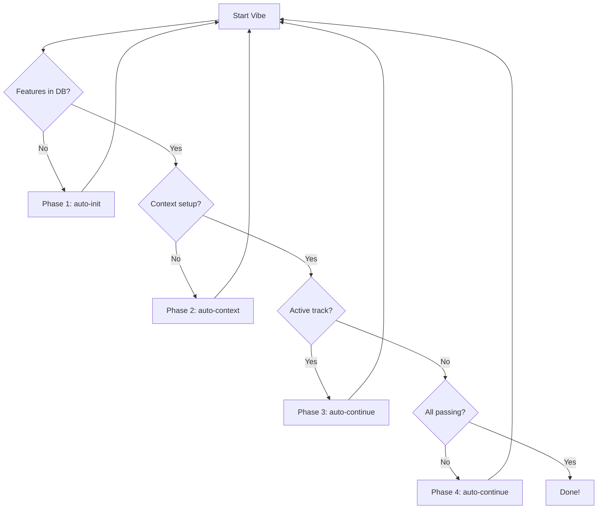

# Architecture: OpenCode Forger

This document outlines the high-level architecture of the `opencode-forger` CLI tool.

## Overview

`opencode-forger` bridges the gap between high-level requirements and implementation by automating the "Vibe Loop". It uses a stateful approach with SQLite for persistence and a modular template system for efficient AI prompting.

> [!NOTE]
> For a deep dive into module call graphs, database schemas, and parallel execution logic, see the [Detailed Internal Architecture](docs/INTERNAL_ARCHITECTURE.md).

## Core Modules

| Module        | Responsibility                                                                     |
| :------------ | :--------------------------------------------------------------------------------- |
| Module        | Responsibility                                                                     |
| :------------ | :--------------------------------------------------------------------------------- |
| `main.rs`     | Entry point, CLI argument parsing, and command routing.                            |
| `cli/`        | Command handlers: `init`, `vibe`, `db`, `reset`, `templates`, `example`.           |
| `autonomous/` | The "Vibe Loop" engine. Contains sub-modules for parallel execution and supervision: |
| &nbsp;&nbsp;`supervisor/`| Replaces `supervisor.rs`: granular state machine actions and looping logic. |
| &nbsp;&nbsp;`parallel/` | Manage git worktrees for concurrent feature implementation (`coordinator.rs`, `process.rs`). |
| &nbsp;&nbsp;`runner/`   | Abstracted command execution (`RealCommandRunner`, `MockCommandRunner`).   |
| &nbsp;&nbsp;`session.rs`| Handles execution of `opencode` with robust timeout/idle monitoring.       |
| `services/`   | Core business logic services:                                                      |
| &nbsp;&nbsp;`scaffold/` | Generates project structures from templates.                               |
| &nbsp;&nbsp;`generator/`| AI-driven project specification generation (replaces old `generator.rs`).  |
| `db/`         | SQLite persistence layer split into `models/` and `repo/`.                         |
| `common/`     | Shared utilities: `logging.rs`, `errors.rs`.                                       |
| `conductor/`  | Context-driven planning. Manages `.conductor/` context and per-feature `tracks/`.  |
| `templates/`  | The Progressive Discovery template system. Minimalist, modular markdown templates. |
| `config/`     | TOML configuration handling with environment variable support.                     |

## The Vibe Loop (Data Flow)

The autonomous runner (`run_main_loop`) operates in 5 distinct phases:



1.  **Phase 1: Init**: Runs the `auto-init` command if the database is empty.
2.  **Phase 2: Context**: Ensures Conductor context (`product.md`, `tech_stack.md`) is established.
3.  **Phase 3/4: Work**: Executes `auto-continue` to implement tasks. In **Parallel Mode**, `parallel::coordinator` distributes these tasks across worktrees.
4.  **Phase 5: Verify & Plan**: Updates the database and calculates the next failing feature to attack.

### Parallel Execution

To speed up development, `opencode-forger` can run in **Parallel Mode** (default).
- **Coordinator**: Manages a pool of workers (Git worktrees).
- **Merge Strategy**: Features are implemented on branches and merged back to `main` via `rebase_and_merge`.
- **Conflict Handling**: If a merge fails, the feature is retried sequentially or marked for manual intervention.


## Template System: Progressive Discovery

To keep AI context windows lean, we use a modular system:

- **Core**: Shared identity and security rules.
- **Modules**: On-demand domain expertise (e.g., `javascript`, `testing`).
- **Commands**: Entry points (`auto-init`, `auto-continue`) that `{{INCLUDE}}` core logic.

## Dual-Model Architecture

The system uses two models with distinct roles:

```
┌─────────────────────────────────────┐
│         REASONING MODEL             │
│  models.reasoning                   │
│  Plans • Reviews • Architects       │
│  Never writes code                  │
└─────────────────────────────────────┘
            │ delegates via @coder
            ▼
┌─────────────────────────────────────┐
│         CODING SUBAGENT             │
│  models.autonomous                  │
│  Implements exactly as specified    │
│  No opinions, no questions          │
└─────────────────────────────────────┘
```

The `@coder` subagent is defined in `.opencode/agent/coder.md` and scaffolded automatically. Use `--single-model` to disable this split.

## Key Directories

- `.forger/`: Stores `config.toml`, `progress.db`, and `app_spec.md`.
- `.opencode/command/`: Stores target-specific command templates for OpenCode.
- `.opencode/agent/`: Stores subagent definitions (including `coder.md`).
- `.conductor/`: Stores product and technical context.
- `tracks/`: Stores per-feature specifications and execution plans.
