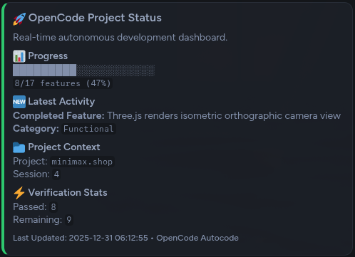

# OpenCode Forger

A Rust CLI that scaffolds autonomous coding projects for [OpenCode](https://github.com/sst/opencode) and runs them to completion. It bridges the gap between high-level application specifications and fully implemented features.

> [!WARNING]
> **AI-Generated Code Disclaimer**: Significant portions of this codebase (including logic, templates, and tests) were generated or refined using Large Language Models. Use with appropriate caution, and always review changes in your local projects.


## Documentation

- [Architecture Overview](ARCHITECTURE.md) - Detailed modules (Supervisor, Decision, Verifier, Runner).
- [Development Guide](docs/DEVELOPMENT.md) - Developer onboarding and contribution guidelines.
- [Contributing](CONTRIBUTING.md) - Code standards and PR process.

## Quick Start

```
# 1. Scaffold a new project (Interactive TUI)
opencode-forger --interactive

# 2. Configure project settings
opencode-forger --config

# 3. Start the autonomous session loop
opencode-forger vibe --developer
```

## Features

- **Zero-Config Scaffolding**: Build complex application specifications using a rich interactive TUI, stored in `.forger/`.
- **SQLite Persistence**: Robust progress tracking with a relational database (`.forger/progress.db`).
- **Persistent Agent Knowledge**: Agents can save discovered facts (ports, paths, keys) to a persistent key-value store (`db knowledge`).
- **Vibe Loop**: Automated session management with intelligent continuation and exponential backoff retry logic.
- **Bun First**: Enforces `bun` usage for JS/TS projects (install, scripts, tests) for maximum speed.
- **Single-Feature Isolation**: Enforces a strict one-feature-per-session rule to minimize context bloat and regressions.
- **Conductor Workflow**: Context-driven planning that creates persistent `.conductor/` and `tracks/` directories to maintain project state.
- **Developer Mode**: Detailed output captured in `opencode-debug.log` for debugging autonomous sessions.
- **Auto-Commit**: Automatically commits each completed feature to Git with AI-generated messages.
- **Stuck Recovery**: Automatically generates alternative implementation paths when progress stalls.
- **Regression Testing**: CLI command to verify all previously completed features directly from the database.
- **Dashboard Webhooks**: Real-time Discord/Slack dashboard that updates a single message with project status and progress bars.  
  
- **MCP Native**: First-class support for Model Context Protocol tools like `osgrep`, `chrome-devtools`, and `sequential-thinking`.
- **Idle Timeout**: Robust hang detection that kills sessions if they stop outputting logs for >10 minutes (configurable).
- **Port Conflict Prevention**: Automatic detection and resolution of port conflicts before starting servers or tests.
- **Module Verification**: Validates ES6 import/export consistency to prevent ReferenceErrors at runtime.
- **Progressive Discovery**: Modular template system that reduces context window usage by ~80%.
- **Dual-Model Architecture**: Reasoning model plans while the `@coder` subagent implements, enabling clearer separation of concerns.
- **Agent-User Communication**: Polling-based Q&A channel via `.forger/COMMUNICATION.md` for async collaboration.
- **Spec Validation**: Validates generated specifications for structural correctness before scaffolding.

## Technology Stack

This tool is built for high-performance autonomous coding:

- **Core**: [Rust](https://www.rust-lang.org/) (Edition 2021) for type safety, speed, and concurrency.
- **TUI**: [iocraft](https://github.com/mitchmindtree/iocraft) for the reactive, phase-based interactive setup and configuration.
- **Database**: SQLite (via `rusqlite`) for ACID-compliant session state and resumption.
- **Templating**: Handlebars for logic-free, maintainable command templates.
- **Agent Protocol**: Dual-model architecture separating Reasoning (Planning) from Autonomy (Coding).

## CLI Reference

### Scaffolding Mode

- `--interactive` (alias: `--init`): Start the interactive spec-building TUI.
- `--default`: Scaffold using the built-in default template immediately.
- `--spec <FILE>`: Use a custom markdown specification file.
- `--output <DIR>` (alias: `-o`): Specify the target directory for scaffolding.
- `--preview` (alias: `--dry-run`): Preview what will be created without writing to disk.
- `--no-subagents`: Disable parallel subagent spec generation (use legacy single-pass).

### Vibe Mode (Autonomous Loop)

- `vibe`: Start the main session loop.
  - `--developer`: Enable verbose debug logging to file.
  - `--limit <N>`: Stop the loop after N iterations.
  - `--config-file <FILE>`: Load a custom TOML configuration.
  - `--single-model`: Disable dual-model (use one model for both reasoning and coding).

### Database Operations

- `db init`: Initialize a new progress database.
- `db migrate`: Import legacy `feature_list.json` data into the SQLite database.
- `db stats`: View high-level feature and session statistics.
- `db export <FILE>`: Export the database contents to a JSON file.
- `db query "<SQL>"`: Execute a SELECT query and display results.
- `db exec "<SQL>"`: Execute a write query (INSERT/UPDATE/DELETE).
- `db tables`: List all tables in the database.
- `db schema <table>`: Show the schema for a specific table.
- `db next-feature`: Get the next incomplete feature.
- `db mark-pass <id>`: Mark a feature as passing.
- `db knowledge set <key> <value>`: Save a persistent fact (flags: `--category`, `--description`).
- `db knowledge get <key>`: Recall a saved fact.
- `db knowledge list`: List all saved facts.

### Utility Commands

- `--config`: Launch the settings configuration TUI.
- `--regression-check`: Verify all features marked as passing in the database.
- `templates list`: View available project templates (Web App, CLI, API).
- `templates use <name>`: Scaffold a project directly from a named template.

## Configuration

Settings are stored in `.forger/config.toml`. You can either use `opencode-forger --config` or edit the file manually. Paths support environment variables like `$HOME`.

```
[models]
default = "opencode/glm-4.7-free"         # Used for spec generation
autonomous = "opencode/minimax-m2.1-free" # Used for code implementation
reasoning = "opencode/glm-4.7-free"       # Used for planning and logic
enhancement = "opencode/glm-4.7-free"     # Used for discover_improvements
fixer = "opencode/grok-code"              # Used for fixing malformed specs

[paths]
database_file = ".forger/progress.db"
log_dir = "$HOME/.local/share/opencode/log"

[autonomous]
delay_between_sessions = 5       # Seconds to wait
max_iterations = 0               # 0 = Run until complete
session_timeout_minutes = 15     # Kill hung sessions after N minutes
idle_timeout_seconds = 600       # Kill if silent for N seconds (10m)
auto_commit = true               # Commit to Git on feature completion
log_level = "DEBUG"              # Logging verbosity

[agent]
max_retry_attempts = 3           # Attempts before switching to research mode
max_research_attempts = 3        # Attempts before giving up
single_feature_focus = true      # Focus AI on one feature at a time

[alternative_approaches]
enabled = true                   # Enable alternative path generation
num_approaches = 7               # Number of paths to explore when stuck
retry_threshold = 3              # Failures before triggering recovery

[conductor]
auto_setup = true                # Initialize project context on first run
context_dir = ".conductor"       # High-level context (product/tech_stack)
tracks_dir = "tracks"            # Per-feature specifications and plans

[mcp]
prefer_osgrep = true             # Use semantic code search
use_sequential_thinking = true   # Enable multi-step reasoning protocol
required_tools = ["chrome-devtools"]

[security]
enforce_allowlist = true         # Use .forger/security-allowlist.json
allowlist_file = ".forger/security-allowlist.json"
blocked_patterns = ["rm -rf /", "sudo"] # Absolute constraints

[notifications]
webhook_enabled = false
webhook_url = "https://discord.com/api/webhooks/..."

[communication]
enabled = true                   # Agent-user Q&A channel
file_path = ".forger/COMMUNICATION.md"
auto_ask_on_error = true         # Auto-post questions on repeated failures

[generation]
complexity = "comprehensive"     # "comprehensive" or "minimal"
enable_subagents = true          # Parallel spec generation (faster)
include_security_section = true
include_testing_strategy = true

[ui]
colored_output = true
verbose = true
show_progress = true
```

## How It Works: The 5-Phase Loop

When you run `vibe`, the engine determines the next action using a phased approach:

1. **Phase 1: Init** (`auto-init`) -> Populates the database (`.forger/progress.db`) and basic structure.
2. **Phase 2: Context** (`auto-context`) -> Establishes project-wide product and technical requirements.
3. **Phase 3: Continue** (`auto-continue`) -> Executes the next task in the active `plan.md` (Track mode).
4. **Phase 4: Completion** -> Checks if all features pass; if so, terminates the loop gracefully.
5. **Phase 5: Transition** (`auto-continue`) -> If no active track exists, picks the next failing feature to implement.

## Template Architecture: Progressive Discovery

Command templates use a modular Progressive Discovery system to minimize token usage:

```
templates/
├── index.json              # Routing table for project types
├── core/                   # Always-included fundamentals
│   ├── identity.md         # Agent identity (6 lines)
│   ├── security.md         # Security constraints (16 lines)
│   └── ...
├── modules/                # Read on-demand by the agent
│   ├── javascript.md       # Web/JS specifics (ports, imports)
│   ├── rust.md             # CLI/Rust patterns
│   ├── testing.md          # Playwright, E2E protocols
│   └── recovery.md         # Stuck protocol
├── commands/
│   ├── auto-init.md        # Lean entry point (~100 lines)
│   └── auto-continue.md    # Lean entry point (~80 lines)
```

The agent reads specialized modules only when needed, reducing context window consumption by ~80%.

## Dual-Model Architecture

The vibe loop uses two models with distinct roles:

| Model | Config Key | Role |
|-------|------------|------|
| **Reasoning** | `models.reasoning` | Plans, reviews, architects — never writes code |
| **Coding** | `models.autonomous` | Implements exactly what it's told via `@coder` subagent |

### How It Works

1. The reasoning model analyzes the feature and plans the implementation.
2. It delegates code writing to `@coder`:
   ```
   @coder Create src/auth/login.ts that exports a login(email, password) function...
   ```
3. The reasoning model reviews the output and runs tests.
4. If issues arise, it provides fix instructions to `@coder`.

Use `--single-model` to disable this and use one model for everything.

## Requirements

- **[OpenCode CLI](https://github.com/sst/opencode)**: Must be installed and authenticated.
- **Rust Toolchain**: 1.75+ required for building from source.
- **SQLite**: Runtime dependency (usually bundled).

## Installation

```
git clone https://github.com/NocturnLabs/opencode-forger.git
cd opencode-forger
cargo install --path .
```

---

_Created by NocturnLabs_
