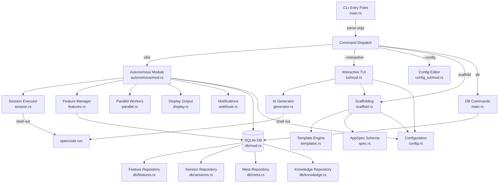
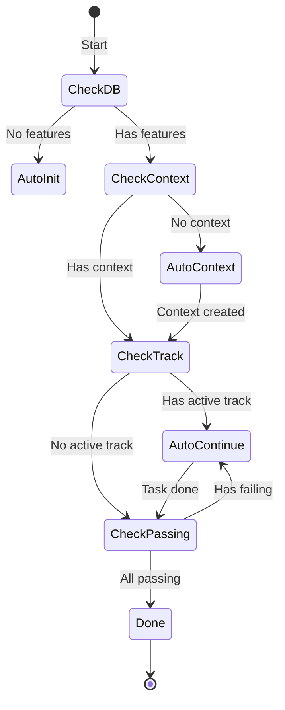

# Crate Name: opencode-forger

Version: 0.5.1  
Repository: NocturnLabs/opencode-forger  
Documentation Generated: 2026-01-04

---

## Executive Summary

`opencode-forger` is a Rust CLI tool that scaffolds and runs autonomous coding projects using the OpenCode AI system. It implements the **"Vibe Loop"** — an automated workflow that iteratively implements, tests, and verifies features until a project specification is complete.

The crate provides:

- **Interactive TUI** for creating project specifications via AI or manual input
- **Autonomous Runner** that executes OpenCode in batch mode with session management
- **SQLite Persistence** for tracking features, sessions, and agent knowledge
- **Template System** for progressive AI prompting
- **Parallel Execution** using git worktrees for concurrent feature development

---

## Architecture Overview



### Layer Responsibilities

| Layer          | Modules                                        | Responsibility                               |
| -------------- | ---------------------------------------------- | -------------------------------------------- |
| **CLI**        | `cli.rs`, `main.rs`                            | Command parsing, routing, entry point        |
| **Autonomous** | `autonomous/*`                                 | Vibe Loop execution, session management      |
| **TUI**        | `tui/*`, `config_tui/*`                        | Interactive specification and config editing |
| **Core**       | `scaffold.rs`, `generator.rs`, `conductor.rs`  | File generation, AI orchestration            |
| **Data**       | `db/*`, `spec.rs`, `config.rs`                 | Persistence, schemas, configuration          |
| **Support**    | `theming.rs`, `validation.rs`, `regression.rs` | Utilities, validation, testing               |

---

## Module Reference

### Module: `crate` (lib.rs)

**Purpose**: Library root — exposes all modules for testing  
**Public API**: 17 re-exported modules  
**Location**: [lib.rs](file:///home/yum/Work/gh-repos/yumlabs-tools/opencode-forger/src/lib.rs)

```rust
pub mod autonomous;
pub mod cli;
pub mod conductor;
pub mod config;
pub mod config_tui;
pub mod db;
pub mod generator;
pub mod regression;
pub mod scaffold;
pub mod spec;
pub mod templates;
pub mod theming;
pub mod tui;
pub mod updater;
pub mod validation;
```

---

## Entry Point: main.rs

**Location**: [main.rs](file:///home/yum/Work/gh-repos/yumlabs-tools/opencode-forger/src/main.rs) (509 lines)

### Function: main

```rust
fn main() -> Result<()>
```

**Lines**: 33-174  
**Purpose**: Entry point that parses CLI args and dispatches to appropriate handlers.

**Call Graph**:

```
main()
├─ Calls:
│  ├─ clap::Parser::parse() - Parse CLI arguments
│  ├─ Cli::mode() - Determine operation mode
│  ├─ updater::check_for_update() - Check for new versions
│  ├─ autonomous::run() [vibe command]
│  ├─ autonomous::run_parallel() [vibe --parallel]
│  ├─ tui::run_interactive() [--interactive mode]
│  ├─ config_tui::run_config_tui() [--config mode]
│  ├─ scaffold::scaffold_default() [--default mode]
│  ├─ scaffold::scaffold_custom() [--spec FILE mode]
│  ├─ handle_db_command() [db subcommand]
│  └─ handle_example_command() [example subcommand]
├─ Called By: (runtime entry point)
├─ Thread Safety: Single-threaded at entry
└─ Error Handling: Returns anyhow::Result
```

**Control Flow**:

1. Parse CLI with `clap::Parser::parse()`
2. Check for updates (background, non-blocking)
3. Match on `Commands` enum variant:
   - `Commands::Vibe` → `autonomous::run()` or `run_parallel()`
   - `Commands::Templates` → template list/use
   - `Commands::Db` → `handle_db_command()`
   - `Commands::Example` → `handle_example_command()`
   - `Commands::Scaffold` → Mode-based dispatch

---

### Function: handle_db_command

```rust
fn handle_db_command(action: &DbAction) -> Result<()>
```

**Lines**: 186-454  
**Purpose**: Routes database subcommands (init, import, query, mark-pass, etc.)

**Match Arms**:
| Action | Handler | Description |
|--------|---------|-------------|
| `Init` | `db::Database::open()` | Create/migrate database |
| `Import` | `FeatureRepository::import_from_json()` | Migrate from JSON |
| `Export` | `FeatureRepository::export_to_json()` | Export features |
| `Query` | `Database::read_query()` | Execute SELECT |
| `Exec` | `Database::write_query()` | Execute INSERT/UPDATE |
| `ListTables` | `Database::list_tables()` | Show schema |
| `Schema` | `Database::describe_table()` | Describe table |
| `NextFeature` | `FeatureRepository::list_remaining()` | Get next work item |
| `MarkPass` | `FeatureRepository::mark_passing()` | Mark feature complete |
| `Knowledge` | Knowledge subcommands | Agent fact storage |

---

**Location**: [autonomous/mod.rs](file:///home/yum/Work/gh-repos/yumlabs-tools/opencode-forger/src/autonomous/mod.rs) (797 lines)  
**Purpose**: The **Vibe Loop** engine — manages autonomous coding sessions.

### Submodule Hierarchy

```
autonomous/
├─ mod.rs           - Entry point
├─ supervisor/      - High-level orchestration
│  ├─ mod.rs        - State machine logic
│  ├─ actions.rs    - Action determination (Command/Fix/Stop)
│  └─ loop.rs       - Main execution loop
├─ parallel/        - Git worktree management
│  ├─ mod.rs        - API
│  ├─ coordinator.rs- Worker pool coordination
│  ├─ process.rs    - Parallel execution logic
│  └─ worktree.rs   - Branch/Worktree creation
├─ runner/          - Execution abstractions
│  ├─ traits.rs     - CommandRunner trait
│  └─ implementation.rs - Real shell execution
├─ decision.rs      - Next-step logic
├─ features.rs      - Feature state helpers
├─ session.rs       - OpenCode process execution
└─ settings.rs      - Loop configuration
```

---

### Function: run

```rust
pub fn run(...) -> Result<()>
```

**Purpose**: Initialize and run the autonomous agent loop.

**Call Graph**:

```
run()
├─ Called By:
│  └─ main::main() [Commands::Vibe]
├─ Calls:
│  ├─ common::logging::init()
│  ├─ load_config()
│  ├─ supervisor::run_supervisor_loop() [Sequential]
│  └─ parallel::run_parallel() [Parallel]
```

---

### Function: supervisor::run_supervisor_loop

**Location**: `src/autonomous/supervisor/loop.rs`

The heart of the Vibe Loop when running sequentially.

**Algorithm**:
1. Determine action (`decision.rs`)
2. Prepare command (`supervisor::actions::prepare_command`)
3. Execute session (`session::execute_opencode_session`)
4. Verify results (`supervisor::verification_step`)
5. Repeat


---

### Function: run_supervisor_loop

```rust
fn run_supervisor_loop(
    config: &Config,
    settings: &LoopSettings,
    enhancement_mode: bool,
    target_feature_id: Option<i64>,
) -> Result<()>
```

**Lines**: 246-469  
**Purpose**: The heart of the Vibe Loop — iterates until done or stopped.

**Algorithm**:

```
WHILE iteration < max_iterations AND NOT stop_requested:
    1. determine_action() → SupervisorAction
    2. MATCH action:
       - Command(template):
           a. generate_continue_template(feature)
           b. execute_opencode_session(template, model, timeout)
           c. IF SessionResult::Complete → mark feature passing
           d. notify_feature_complete() if webhooks enabled
       - Fix(feature, error):
           a. generate_fix_template(feature, error)
           b. execute_opencode_session("auto-fix", ...)
       - Stop:
           BREAK
    3. Sleep(delay_seconds)
    4. increment iteration
```

**State Machine** (phases from ARCHITECTURE.md):



---

### Function: determine_action

```rust
fn determine_action(
    db_path: &Path,
    config: &Config,
    target_feature_id: Option<i64>,
) -> Result<SupervisorAction>
```

**Lines**: 531-660  
**Purpose**: Analyze project state and decide what command to run next.

**Decision Logic**:

```rust
// 1. Open database
let db = Database::open(db_path)?;
let features = db.features();

// 2. Check if any features exist
if features.count()?.0 + features.count()?.1 == 0 {
    return Ok(SupervisorAction::Command("auto-init"));
}

// 3. Check for conductor context
if !conductor::context_exists(config) {
    return Ok(SupervisorAction::Command("auto-context"));
}

// 4. Check for active track with incomplete tasks
if let Some(track) = conductor::get_active_track(config)? {
    return Ok(SupervisorAction::Command("auto-continue"));
}

// 5. Get next failing feature
if let Some(feature) = features.list_remaining()?.first() {
    // Check if feature has a previous error (regression)
    if let Some(error) = &feature.last_error {
        return Ok(SupervisorAction::Fix {
            feature: feature.clone(),
            error: error.clone()
        });
    }
    return Ok(SupervisorAction::Command("auto-continue"));
}

// 6. All passing
Ok(SupervisorAction::Stop)
```

---

### Enum: VerificationFailure

```rust
#[derive(Debug, PartialEq)]
enum VerificationFailure {
    NoTestsMatch,      // Filter matched no tests
    TestFileMissing,   // Test file doesn't exist
    CommandError,      // Invalid command syntax
    AssertionFailure,  // Actual test failure
}
```

**Lines**: 470-492  
**Purpose**: Classify verification failures to determine corrective action.

---

## Session Execution Module

**Location**: [autonomous/session.rs](file:///home/yum/Work/gh-repos/yumlabs-tools/opencode-forger/src/autonomous/session.rs) (455 lines)

### Struct: TokenStats

```rust
#[derive(Debug, Default, Clone)]
pub struct TokenStats {
    pub input_tokens: u64,
    pub output_tokens: u64,
    pub total_cost: f64,
}
```

**Purpose**: Token usage statistics from OpenCode for cost tracking.

---

### Enum: SessionResult

```rust
pub enum SessionResult {
    Continue,           // Session done, continue to next
    Complete,           // All tests passing, project done
    Error(String),      // Error occurred, stop
    Stopped,            // Stop signal detected
}
```

**Purpose**: Outcome of a single OpenCode session.

---

### Function: execute_opencode_session

```rust
pub fn execute_opencode_session(
    command: &str,
    model: &str,
    log_level: &str,
    session_id: Option<&str>,
    timeout_minutes: u32,
    logger: &DebugLogger,
) -> Result<SessionResult>
```

**Lines**: 118-151  
**Purpose**: Execute an OpenCode session with timeout support.

**Implementation**:

1. Build command: `opencode run [command] -m [model] -l [log_level]`
2. If `timeout_minutes > 0`: spawn with timeout monitoring
3. Else: execute synchronously
4. Stream stdout/stderr to logger
5. Check for completion signals in output
6. Return appropriate `SessionResult`

**Completion Detection**:

```rust
const FEATURE_COMPLETE_PATTERNS: &[&str] = &[
    "===SESSION_COMPLETE===",
    "===FEATURE_DONE===",
    "marked as passing",
    "Feature marked as passing",
    "Feature complete",
    "✅ Verified!",
];
```

---

### Function: execute_with_timeout

```rust
fn execute_with_timeout(
    cmd: &mut Command,
    timeout_minutes: u32,
    logger: &DebugLogger,
) -> Result<SessionResult>
```

**Lines**: 208-370  
**Purpose**: Execute with polling-based timeout and real-time output capture.

**Algorithm**:

```
1. Spawn child process with piped stdout/stderr
2. Create reader threads for stdout and stderr
3. WHILE child running:
   a. Check elapsed time vs timeout
   b. Check for stop signal file
   c. Poll output lines for completion signals
   d. Sleep(POLL_INTERVAL_MS)
4. IF timeout reached: terminate child, return SessionResult::Error
5. IF stop signal: terminate child, return SessionResult::Stopped
6. IF completion pattern found: return SessionResult::Complete
7. ON normal exit: return SessionResult::Continue or Error based on exit code
```

---

## Parallel Execution Module

**Location**: [autonomous/parallel.rs](file:///home/yum/Work/gh-repos/yumlabs-tools/opencode-forger/src/autonomous/parallel.rs) (292 lines)

### Struct: WorkerResult

```rust
#[derive(Debug)]
pub struct WorkerResult {
    pub feature_id: i64,
    pub success: bool,
    pub branch_name: String,
    pub worktree_path: PathBuf,
}
```

**Purpose**: Outcome of a worker completing a feature.

---
## Parallel Execution Module

**Location**: [autonomous/parallel/](file:///home/yum/Work/gh-repos/yumlabs-tools/opencode-forger/src/autonomous/parallel/)
**Purpose**: Manage concurrent feature implementation using Git Worktrees.

### Struct: Coordinator

**Location**: `src/autonomous/parallel/coordinator.rs`

```rust
pub struct Coordinator {
    worker_count: usize,
    base_path: PathBuf,
    merge_queue: Vec<WorkerResult>,
}
```

**Purpose**: Coordinate parallel workers and manage merge queue.

**Methods**:
- `new(worker_count, base_path)` - Initialize coordinator
- `queue_for_merge(result)` - Queue completed worker
- `process_merge_queue()` - Clean up worktrees, merge successful branches

---

### Function: process::run_parallel

**Location**: `src/autonomous/parallel/process.rs`

```rust
pub fn run_parallel(...)
```

**Purpose**: Main loop for parallel execution mode.

**flow**:
1. Initialize Coordinator
2. Loop until all features complete:
   a. Check for available slots
   b. Assign pending features to new workers (create worktree)
   c. Poll running workers for completion
   d. Coordinator handles merges
   e. Sleep briefly

---

### Module: worktree

**Location**: `src/autonomous/parallel/worktree.rs`

Handles the low-level git operations:
- `create_worktree`: `git worktree add ...`
- `remove_worktree`: `git worktree remove ...`


---

## Database Module

**Location**: [db/mod.rs](file:///home/yum/Work/gh-repos/yumlabs-tools/opencode-forger/src/db/mod.rs) (281 lines)

### Module Structure

```
db/
├─ mod.rs       - Database wrapper, connection management
├─ features.rs  - Feature CRUD operations
├─ sessions.rs  - Session tracking
├─ meta.rs      - Key-value metadata
├─ knowledge.rs - Agent knowledge base
└─ schema.rs    - SQL schema definitions
```

---

### Struct: Database

```rust
pub struct Database {
    conn: Arc<Mutex<Connection>>,
}
```

**Purpose**: Thread-safe SQLite database wrapper.

**Methods**:
| Method | Signature | Purpose |
|--------|-----------|---------|
| `open` | `(path: &Path) -> Result<Self>` | Open/create database |
| `open_default` | `() -> Result<Self>` | Open `.forger/progress.db` |
| `init_schema` | `(&self) -> Result<()>` | Run migrations |
| `features` | `(&self) -> FeatureRepository` | Get feature repo |
| `sessions` | `(&self) -> SessionRepository` | Get session repo |
| `meta` | `(&self) -> MetaRepository` | Get meta repo |
| `knowledge` | `(&self) -> KnowledgeRepository` | Get knowledge repo |
| `read_query` | `(&self, sql: &str) -> Result<String>` | Execute SELECT |
| `write_query` | `(&self, sql: &str) -> Result<usize>` | Execute INSERT/UPDATE |

---

### Database Schema

**Location**: [db/schema.rs](file:///home/yum/Work/gh-repos/yumlabs-tools/opencode-forger/src/db/schema.rs)

**Tables**:

```sql
-- Features table (replaces feature_list.json)
CREATE TABLE features (
    id INTEGER PRIMARY KEY AUTOINCREMENT,
    category TEXT NOT NULL,
    description TEXT NOT NULL UNIQUE,
    passes INTEGER DEFAULT 0,
    verification_command TEXT,
    last_error TEXT,
    created_at TEXT,
    updated_at TEXT
);

-- Feature verification steps
CREATE TABLE feature_steps (
    id INTEGER PRIMARY KEY,
    feature_id INTEGER NOT NULL,
    step_order INTEGER NOT NULL,
    step_text TEXT NOT NULL,
    FOREIGN KEY (feature_id) REFERENCES features(id) ON DELETE CASCADE
);

-- Autonomous sessions
CREATE TABLE sessions (
    id INTEGER PRIMARY KEY,
    session_number INTEGER NOT NULL,
    started_at TEXT,
    completed_at TEXT,
    features_before INTEGER DEFAULT 0,
    features_after INTEGER DEFAULT 0,
    status TEXT DEFAULT 'running'
);

-- Session events/logs
CREATE TABLE session_events (
    id INTEGER PRIMARY KEY,
    session_id INTEGER NOT NULL,
    event_type TEXT NOT NULL,
    message TEXT,
    timestamp TEXT
);

-- Key-Value metadata (e.g., discord_message_id)
CREATE TABLE meta (
    key TEXT PRIMARY KEY,
    value TEXT NOT NULL,
    updated_at TEXT
);

-- Agent Knowledge Base
CREATE TABLE knowledge (
    key TEXT PRIMARY KEY,
    value TEXT NOT NULL,
    category TEXT DEFAULT 'general',
    description TEXT,
    created_at TEXT,
    updated_at TEXT
);
```

---

### Feature Repository

**Location**: [db/features.rs](file:///home/yum/Work/gh-repos/yumlabs-tools/opencode-forger/src/db/features.rs) (353 lines)

#### Struct: Feature

```rust
#[derive(Debug, Clone, Serialize, Deserialize)]
pub struct Feature {
    pub id: Option<i64>,
    pub category: String,
    pub description: String,
    pub steps: Vec<String>,
    pub passes: bool,
    pub verification_command: Option<String>,
    pub last_error: Option<String>,
}
```

**Purpose**: Feature data structure (replaces JSON format).

---

#### Struct: FeatureRepository

```rust
pub struct FeatureRepository {
    conn: Arc<Mutex<Connection>>,
}
```

**Methods**:
| Method | Purpose |
|--------|---------|
| `insert(&self, feature: &Feature) -> Result<i64>` | Create new feature |
| `list_all(&self) -> Result<Vec<Feature>>` | Get all features |
| `list_passing(&self) -> Result<Vec<Feature>>` | Get completed features |
| `list_remaining(&self) -> Result<Vec<Feature>>` | Get incomplete features |
| `count(&self) -> Result<(usize, usize)>` | Count (passing, total) |
| `mark_passing(&self, desc: &str) -> Result<bool>` | Mark feature complete |
| `mark_failing_with_error(&self, desc: &str, error: Option<&str>)` | Mark failed with context |
| `import_from_json(&self, path: &Path) -> Result<usize>` | Migrate from JSON |
| `export_to_json(&self, path: &Path) -> Result<()>` | Export to JSON |

---

## Configuration Module

**Location**: [config.rs](file:///home/yum/Work/gh-repos/yumlabs-tools/opencode-forger/src/config.rs) (717 lines)

### Config Hierarchy

```rust
pub struct Config {
    pub models: ModelsConfig,
    pub generation: GenerationConfig,
    pub paths: PathsConfig,
    pub autonomous: AutonomousConfig,
    pub agent: AgentConfig,
    pub alternative_approaches: AlternativeApproachesConfig,
    pub conductor: ConductorConfig,
    pub mcp: McpConfig,
    pub stuck_recovery: StuckRecoveryConfig,
    pub security: SecurityConfig,
    pub notifications: NotificationsConfig,
    pub features: FeaturesConfig,
    pub scaffolding: ScaffoldingConfig,
    pub ui: UiConfig,
}
```

---

#### Section: ModelsConfig

```rust
pub struct ModelsConfig {
    pub autonomous: String,    // Model for autonomous execution
    pub reasoning: String,     // Model for planning/review
    pub generator: String,     // Model for spec generation
}
```

**Default**: All use `"opencode/gemini-2.0-flash-001"`

---

#### Section: AutonomousConfig

```rust
pub struct AutonomousConfig {
    pub max_iterations: usize,     // Default: 100
    pub timeout_minutes: u32,      // Default: 30
    pub delay_seconds: u32,        // Default: 5
    pub log_level: String,         // Default: "warn"
}
```

---

#### Section: NotificationsConfig

```rust
pub struct NotificationsConfig {
    pub discord_webhook_url: Option<String>,
}
```

**Purpose**: Discord webhook for feature completion notifications.

---

### Function: Config::load

```rust
pub fn load(dir: Option<&Path>) -> Result<Self>
```

**Purpose**: Load configuration from `forger.toml` with env var expansion.

**Search Order**:

1. `forger.toml` in specified directory
2. `.forger/config.toml` in specified directory
3. Current directory `forger.toml`
4. Current directory `.forger/config.toml`
5. Default values if not found

---

## CLI Module

**Location**: [cli.rs](file:///home/yum/Work/gh-repos/yumlabs-tools/opencode-forger/src/cli.rs) (353 lines)

### Struct: Cli

```rust
#[derive(Parser, Debug)]
#[command(name = "opencode-forger")]
#[command(about = "Scaffold and run autonomous coding projects")]
pub struct Cli {
    #[command(subcommand)]
    pub command: Option<Commands>,

    #[arg(short, long)]
    pub interactive: bool,

    #[arg(short, long)]
    pub default: bool,

    #[arg(long)]
    pub spec: Option<PathBuf>,

    #[arg(long)]
    config: bool,
}
```

---

### Enum: Commands

```rust
pub enum Commands {
    Vibe {
        limit: Option<usize>,
        config: Option<PathBuf>,
        parallel: Option<usize>,
        developer: bool,
        single_model: bool,
        target_feature: Option<i64>,
        enhancement: bool,
    },
    Templates { action: TemplateAction },
    Db { action: DbAction },
    Example { topic: ExampleTopic },
    Scaffold { ... },
    Update,
    Docs { topic: Option<String> },
}
```

---

### Enum: DbAction

```rust
pub enum DbAction {
    Init { path: Option<PathBuf> },
    Import { path: PathBuf, reset: bool },
    Export { path: PathBuf },
    Query { sql: String },
    Exec { sql: String },
    ListTables,
    Schema { table: String },
    NextFeature,
    MarkPass { id: i32 },
    Knowledge { action: KnowledgeAction },
}
```

---

## Scaffold Module

**Location**: [scaffold.rs](file:///home/yum/Work/gh-repos/yumlabs-tools/opencode-forger/src/scaffold.rs) (349 lines)

### Purpose

Generate project structure and OpenCode command templates from specifications.

### Key Functions

#### scaffold_with_spec_text

```rust
pub fn scaffold_with_spec_text(
    output_dir: &Path,
    spec_content: &str
) -> Result<()>
```

**Lines**: 83-249  
**Purpose**: Main scaffolding logic — creates directory structure and files.

**Files Created**:

```
output_dir/
├─ .forger/
│  ├─ config.toml         - User configuration
│  ├─ progress.db         - SQLite database
│  └─ app_spec.md         - Project specification
├─ .opencode/
│  ├─ command/
│  │  ├─ auto-init.md     - Initialization command
│  │  ├─ auto-continue.md - Continuation command
│  │  ├─ auto-context.md  - Context setup command
│  │  └─ auto-fix.md      - Fix regression command
│  └─ agent/
│     ├─ coder.md         - Coding subagent
│     ├─ spec-product.md  - Spec product agent
│     ├─ spec-architecture.md
│     └─ spec-quality.md
├─ .conductor/            - Conductor context directory
├─ tracks/                - Feature tracks directory
├─ opencode.json          - OpenCode configuration
└─ .gitignore
```

---

#### resolve_includes

```rust
fn resolve_includes(template: &str) -> String
```

**Lines**: 41-65  
**Purpose**: Process `{{INCLUDE path}}` directives in templates.

**Pattern**: Implements "Progressive Discovery" — templates include sub-templates on demand:

```markdown
{{INCLUDE templates/core/identity.xml}}
{{INCLUDE templates/core/security.xml}}
```

---

## Generator Module

**Location**: [generator.rs](file:///home/yum/Work/gh-repos/yumlabs-tools/opencode-forger/src/generator.rs) (534 lines)

### Purpose

AI-based spec generation using OpenCode CLI.

### Function: generate_spec_from_idea

```rust
pub fn generate_spec_from_idea<F: FnMut(&str)>(
    idea: &str,
    testing_preference: Option<&str>,
    model: Option<&str>,
    use_subagents: bool,
    mut on_output: F,
) -> Result<String>
```

**Lines**: 29-221  
**Purpose**: Generate project specification from natural language idea.

**Algorithm**:

1. Build generation prompt from template + user idea
2. If `use_subagents`: spawn parallel spec generation agents
3. Shell out to `opencode run` with prompt
4. Stream output to callback `on_output`
5. Extract XML spec from output
6. If malformed: retry with fix prompt (up to 5 attempts)
7. Return extracted specification

---

### Function: extract_spec_from_output

```rust
fn extract_spec_from_output(output: &str) -> Result<String>
```

**Lines**: 439-479  
**Purpose**: Extract `<project_specification>` XML from OpenCode output.

**Extraction Logic**:

1. Find `<project_specification>` start tag
2. Find `</project_specification>` end tag
3. Extract content between tags
4. If not found, search for code blocks with XML

---

## Conductor Module

**Location**: [conductor.rs](file:///home/yum/Work/gh-repos/yumlabs-tools/opencode-forger/src/conductor.rs) (273 lines)

### Purpose

Context-driven development workflow management.

### Struct: Track

```rust
#[derive(Debug, Clone)]
pub struct Track {
    pub name: String,
    pub path: PathBuf,
    pub has_spec: bool,
    pub has_plan: bool,
}
```

**Purpose**: Represents a unit of work (typically one feature).

---

### Struct: PlanTask

```rust
#[derive(Debug, Clone)]
pub struct PlanTask {
    pub line_number: usize,
    pub text: String,
    pub completed: bool,
}
```

**Purpose**: A task from a plan.md file with checkbox status.

---

### Key Functions

| Function                         | Purpose                              |
| -------------------------------- | ------------------------------------ |
| `context_exists(config)`         | Check if `.conductor/` is set up     |
| `create_context_dirs(config)`    | Create conductor directory structure |
| `get_active_track(config)`       | Find track with incomplete tasks     |
| `create_track(config, name)`     | Create new track directory           |
| `parse_plan(path)`               | Parse tasks from plan.md             |
| `get_next_task(tasks)`           | Get next incomplete task             |
| `mark_task_complete(path, line)` | Update `[ ]` to `[x]`                |
| `slugify(name)`                  | Convert name to URL-safe slug        |

---

## Spec Module

**Location**: [spec.rs](file:///home/yum/Work/gh-repos/yumlabs-tools/opencode-forger/src/spec.rs) (213 lines)

### Struct: AppSpec

```rust
#[derive(Debug, Clone, Serialize, Deserialize, Default)]
pub struct AppSpec {
    pub project_name: String,
    pub overview: String,
    pub features: Vec<Feature>,
    pub success_criteria: Vec<String>,
    pub technology: Option<TechStack>,
    pub database: Option<DatabaseConfig>,
    pub api_endpoints: Option<Vec<ApiEndpoint>>,
}
```

**Purpose**: Technology-agnostic application specification.

---

### Method: to_spec_text

```rust
impl AppSpec {
    pub fn to_spec_text(&self) -> String
}
```

**Purpose**: Convert to XML format used by prompts.

**Output Format**:

```xml
<project_specification>
  <project_name>MyApp</project_name>
  <overview>Description here</overview>
  <technology_stack>
    <languages>Rust</languages>
    <frameworks>Ratatui</frameworks>
  </technology_stack>
  <core_features>
    <feature priority="high">
      <name>Feature Name</name>
      <description>Feature description</description>
    </feature>
  </core_features>
  <success_criteria>
    - Criterion 1
    - Criterion 2
  </success_criteria>
</project_specification>
```

---

## Validation Module

**Location**: [validation.rs](file:///home/yum/Work/gh-repos/yumlabs-tools/opencode-forger/src/validation.rs) (374 lines)

### Purpose

Validate generated specifications for structural correctness.

### Struct: ValidationResult

```rust
#[derive(Debug)]
pub struct ValidationResult {
    pub is_valid: bool,
    pub has_project_name: bool,
    pub has_overview: bool,
    pub has_features: bool,
    pub has_success_criteria: bool,
    pub has_technology: bool,
    pub has_database: bool,
    pub has_api_endpoints: bool,
    pub stats: SpecStats,
    pub errors: Vec<String>,
    pub warnings: Vec<String>,
}
```

---

### Function: validate_spec

```rust
pub fn validate_spec(
    spec_text: &str,
    min_features: usize,
    min_endpoints: usize,
) -> Result<ValidationResult>
```

**Purpose**: Parse and validate specification XML structure.

**Checks**:

- Required elements present (`project_name`, `overview`, `features`)
- Minimum feature count met
- Minimum endpoint count met (if API project)
- Well-formed XML structure

---

## Regression Module

**Location**: [regression.rs](file:///home/yum/Work/gh-repos/yumlabs-tools/opencode-forger/src/regression.rs) (199 lines)

### Purpose

Run verification commands for passing features to detect regressions.

### Function: run_regression_check

```rust
pub fn run_regression_check(
    features: &[Feature],
    category_filter: Option<&str>,
    verbose: bool,
) -> Result<RegressionSummary>
```

**Purpose**: Execute verification commands for all passing features.

**Algorithm**:

```
FOR each feature in features WHERE passes == true:
    IF feature.verification_command.is_some():
        result = shell_exec(verification_command)
        IF result.success:
            automated_passed += 1
        ELSE:
            automated_failed += 1
            record_error(stderr)
    ELSE:
        manual_required += 1
RETURN RegressionSummary { ... }
```

---

## Theming Module

**Location**: [theming.rs](file:///home/yum/Work/gh-repos/yumlabs-tools/opencode-forger/src/theming.rs) (117 lines)

### Color Palette

```rust
pub mod colors {
    pub const PRIMARY: Color = Color::Color256(117);  // #87d7ff
    pub const SUCCESS: Color = Color::Color256(114);  // #87d787
    pub const WARNING: Color = Color::Color256(214);  // #ffaf00
    pub const ERROR: Color = Color::Color256(203);    // #ff5f5f
    pub const MUTED: Color = Color::Color256(245);    // #8a8a8a
    pub const HIGHLIGHT: Color = Color::Color256(87); // #5fffff
}
```

### Symbols

```rust
pub mod symbols {
    pub const SUCCESS: &str = "✔";
    pub const FAILURE: &str = "✗";
    pub const PENDING: &str = "○";
    pub const RUNNING: &str = "●";
    pub const ARROW: &str = "→";
    pub const BULLET: &str = "•";
    pub const INFO: &str = "ℹ";
    pub const WARNING: &str = "⚠";
    pub const SPARKLE: &str = "✨";
}
```

### Box Drawing

```rust
pub mod boxes {
    pub const TOP_LEFT: &str = "╭";
    pub const TOP_RIGHT: &str = "╮";
    pub const BOTTOM_LEFT: &str = "╰";
    pub const BOTTOM_RIGHT: &str = "╯";
    pub const HORIZONTAL: &str = "─";
    pub const VERTICAL: &str = "│";
}
```

---

## TUI Module

**Location**: [tui/mod.rs](file:///home/yum/Work/gh-repos/yumlabs-tools/opencode-forger/src/tui/mod.rs) (184 lines)

### Submodules

```
tui/
├─ mod.rs        - Mode selection, main entry
├─ generated.rs  - AI spec generation flow
├─ manual.rs     - Manual form entry
├─ inputs.rs     - Input helpers
├─ actions.rs    - Post-generation actions
└─ validation.rs - Spec preview/validation
```

### Interactive Modes

```rust
enum InteractiveMode {
    Generated,    // AI creates spec from idea
    Manual,       // Step-by-step form
    FromSpecFile, // Use existing spec file
    Default,      // Built-in template
}
```

### Function: run_interactive

```rust
pub fn run_interactive(output_dir: &Path, use_subagents: bool) -> Result<()>
```

**Purpose**: Entry point for interactive TUI.

**Flow**:

1. Display header
2. Load/configure settings
3. Select mode (Generated/Manual/File/Default)
4. Execute mode-specific handler
5. Scaffold project

---

## Updater Module

**Location**: [updater.rs](file:///home/yum/Work/gh-repos/yumlabs-tools/opencode-forger/src/updater.rs) (67 lines)

### Function: check_for_update

```rust
pub fn check_for_update() -> Result<Option<String>>
```

**Purpose**: Check GitHub releases for newer version.

### Function: update

```rust
pub fn update() -> Result<()>
```

**Purpose**: Self-update from GitHub releases.

**Implementation**: Uses `self_update` crate with GitHub backend.

---

## Dependency Graph

### Internal Module Dependencies

```
main.rs
├─ cli.rs (argument parsing)
├─ autonomous/mod.rs (vibe command)
│  ├─ autonomous/session.rs
│  ├─ autonomous/display.rs
│  ├─ autonomous/features.rs
│  ├─ autonomous/git.rs
│  ├─ autonomous/parallel.rs
│  ├─ autonomous/webhook.rs
│  └─ autonomous/debug_logger.rs
├─ tui/mod.rs (interactive mode)
│  └─ generator.rs
├─ config_tui/mod.rs (config mode)
├─ scaffold.rs
│  ├─ spec.rs
│  └─ templates.rs
├─ db/mod.rs
│  ├─ db/features.rs
│  ├─ db/sessions.rs
│  ├─ db/meta.rs
│  ├─ db/knowledge.rs
│  └─ db/schema.rs
├─ config.rs
├─ conductor.rs
├─ validation.rs
├─ regression.rs
├─ theming.rs
└─ updater.rs
```

### External Dependencies

| Crate         | Version | Purpose                                 |
| ------------- | ------- | --------------------------------------- |
| `clap`        | 4.5.53  | CLI argument parsing with derive macros |
| `serde`       | 1.0.228 | Serialization framework                 |
| `serde_json`  | 1.0.148 | JSON serialization                      |
| `toml`        | 0.9.10  | TOML config parsing                     |
| `handlebars`  | 6.4.0   | Template engine                         |
| `dialoguer`   | 0.12    | Interactive prompts                     |
| `console`     | 0.16.2  | Terminal styling                        |
| `walkdir`     | 2.5.0   | Directory traversal                     |
| `anyhow`      | 1.0.100 | Error handling                          |
| `thiserror`   | 2.0.17  | Error derive macros                     |
| `chrono`      | 0.4.42  | Date/time handling                      |
| `ctrlc`       | 3.4     | Ctrl+C signal handling                  |
| `quick-xml`   | 0.38.4  | XML parsing                             |
| `similar`     | 2.7.0   | Diff generation                         |
| `rusqlite`    | 0.38.0  | SQLite database (bundled)               |
| `self_update` | 0.42.0  | Self-update from GitHub                 |
| `num_cpus`    | 1.17.0  | CPU count for parallelism               |

---

## Error Handling Architecture

### Error Propagation

All functions use `anyhow::Result<T>` for error handling:

```rust
use anyhow::{Context, Result};

fn example() -> Result<()> {
    let config = Config::load(None)
        .context("Failed to load configuration")?;
    // ...
    Ok(())
}
```

### Error Sources

| Layer      | Error Types               | Handling                |
| ---------- | ------------------------- | ----------------------- |
| CLI        | `clap` parse errors       | Exit with usage message |
| Config     | `toml` parse, file I/O    | Context-wrapped         |
| Database   | `rusqlite::Error`         | Context-wrapped         |
| Session    | Process spawn, timeout    | SessionResult::Error    |
| Validation | XML parse, missing fields | ValidationResult.errors |

---

## Concurrency Model

### Single-Threaded Mode (default)

- Main loop runs synchronously
- Session execution uses child process with polling
- Timeout checked via elapsed time

### Parallel Mode (`vibe --parallel N`)

- Uses git worktrees for isolation
- Each worker gets dedicated directory and branch
- Coordinator manages merge queue
- Thread spawning via `std::thread::spawn`

### Shared State

- `STOP_REQUESTED: AtomicBool` - Global stop signal
- `DebugLogger: OnceLock<DebugLogger>` - Global logger

---

## Testing Architecture

### Test Organization

```
tests/
├─ regression/     - Regression test framework
└─ *.rs            - Integration tests

src/
└─ <module>.rs     - Unit tests in #[cfg(test)] mod tests
```

### Test Coverage by Module

| Module             | Unit Tests              | Integration |
| ------------------ | ----------------------- | ----------- |
| `cli.rs`           | ✓ (mode tests)          | -           |
| `conductor.rs`     | ✓ (slugify, parse_plan) | -           |
| `db/features.rs`   | ✓ (CRUD ops)            | -           |
| `db/sessions.rs`   | ✓ (lifecycle)           | -           |
| `regression.rs`    | ✓ (check run)           | -           |
| `validation.rs`    | ✓ (spec validation)     | -           |
| `templates.rs`     | ✓ (token counts)        | -           |

### Running Tests

```bash
cargo test                    # All tests
cargo test --lib              # Unit tests only
cargo test --test integration # Integration tests
```

---

## Performance Characteristics

### Hot Paths

1. **Session execution** (`execute_opencode_session`)

   - Spawns child process
   - Polls output at 500ms intervals
   - Critical for responsiveness

2. **Feature state lookup** (`FeatureRepository::list_remaining`)
   - Called every iteration
   - O(n) where n = feature count
   - Indexed by `passes` column

### Memory Usage

- SQLite connection: ~1MB
- Template strings: ~50KB embedded
- Session output buffer: ~1MB per session

### Optimization Opportunities

- [ ] Connection pooling for parallel workers
- [ ] Lazy template loading
- [ ] Incremental output parsing

---

## Key Design Decisions

### ADR-001: SQLite over JSON

**Decision**: Use SQLite instead of `feature_list.json`  
**Rationale**: ACID transactions, concurrent access, queryability  
**Consequences**: Added `rusqlite` dependency, migration code

### ADR-002: Progressive Discovery Templates

**Decision**: Modular templates with `{{INCLUDE}}` directives  
**Rationale**: Keep AI context windows lean  
**Consequences**: Template resolution at scaffold time

### ADR-003: Dual-Model Architecture

**Decision**: Separate reasoning and coding models  
**Rationale**: Specialized models for planning vs implementation  
**Consequences**: `@coder` subagent, `--single-model` fallback

### ADR-004: Git Worktrees for Parallelism

**Decision**: Isolated worktrees per feature  
**Rationale**: No conflicts during parallel development  
**Consequences**: Disk space overhead, merge complexity

---

## File Index

| File                         | Lines | Description                   |
| ---------------------------- | ----- | ----------------------------- |
| `main.rs`                    | 509   | Entry point, command dispatch |
| `lib.rs`                     | 21    | Module exports                |
| `cli.rs`                     | 353   | CLI definitions               |
| `config.rs`                  | 717   | Configuration structs         |
| `autonomous/mod.rs`          | 797   | Vibe Loop engine              |
| `autonomous/session.rs`      | 455   | OpenCode execution            |
| `autonomous/parallel.rs`     | 292   | Git worktree workers          |
| `autonomous/display.rs`      | 212   | Terminal output               |
| `autonomous/webhook.rs`      | 318   | Discord notifications         |
| `autonomous/debug_logger.rs` | 151   | Developer logging             |
| `autonomous/git.rs`          | 50    | Auto-commit                   |
| `db/mod.rs`                  | 281   | Database wrapper              |
| `db/features.rs`             | 353   | Feature CRUD                  |
| `db/sessions.rs`             | 320   | Session tracking              |
| `db/schema.rs`               | 91    | SQL schema                    |
| `scaffold.rs`                | 349   | Project scaffolding           |
| `generator.rs`               | 534   | AI spec generation            |
| `conductor.rs`               | 273   | Track management              |
| `spec.rs`                    | 213   | AppSpec schema                |
| `templates.rs`               | 343   | Template library              |
| `validation.rs`              | 374   | Spec validation               |
| `regression.rs`              | 199   | Regression testing            |
| `tui/mod.rs`                 | 184   | Interactive TUI               |
| `config_tui/mod.rs`          | 85    | Config editor                 |
| `theming.rs`                 | 117   | TUI styling                   |
| `updater.rs`                 | 67    | Self-update                   |

**Total**: ~8,000 lines of Rust code

---

## Appendix: Command Templates

### auto-init.xml

Initializes project from specification, creates feature database.

### auto-continue.xml

Continues work on next incomplete feature.

### auto-context.xml

Sets up conductor context (product.md, tech_stack.md).

### auto-fix.xml

Fixes a regression based on last_error context.

---

_End of Architectural Documentation_
